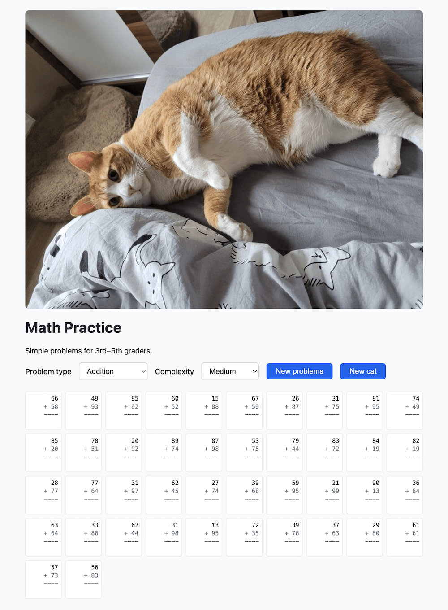

# Math Practice

A simple Vue.js single-page app that generates addition and subtraction problems for 3rd–5th graders.

**Repository:** [GitHub — dmytrofrolov/cat_math](https://github.com/dmytrofrolov/cat_math)



## Features

- **Problem types:** Addition, Subtraction
- **Complexity levels:** Easy, Medium, Hard
  - Easy: 2-digit numbers, sum &lt; 100 (addition) or top &gt; bottom (subtraction)
  - Medium: 2-digit numbers, sum ≥ 100 (addition) or top &gt; bottom (subtraction)
  - Hard: 3–4 digit numbers
- **Hero image:** Random cat image (CATAAS), 4:3 aspect ratio, scale to fit
- **Buttons:** “New problems” regenerates the math grid; “New cat” reloads the hero image
- **Print:** A4 layout; hero image and problem grid visible; controls hidden

## How to run

Open `index.html` in a browser (no build step). Or serve the folder locally, for example:

```bash
npx serve .
# or
python3 -m http.server 8000
```

Then open the URL shown (e.g. http://localhost:3000 or http://localhost:8000).

### Docker

Serve the app with nginx via Docker Compose (container port 80 is mapped to a random host port):

```bash
docker compose up --build
```

Check the port in the output (e.g. `0.0.0.0:49123->80/tcp`) and open http://localhost:49123 (or the port shown).

## Credits

- **Paw icon (background pattern):** [Paw Black Shape](https://www.svgrepo.com/svg/41746/paw-black-shape) — SVG Repo
